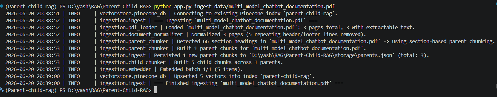
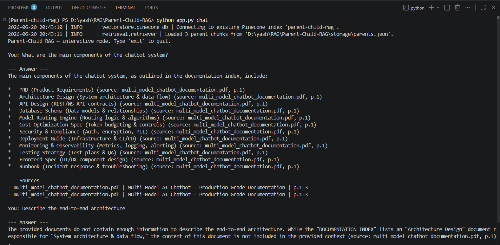

# Parent-Child RAG

A clean, modular of the **Parent-Child Retrieval** pattern for RAG:
small "child" chunks are embedded and searched, but the _larger_ "parent"
chunk they belong to is what actually gets sent to the LLM as context. This
gives you precise retrieval with rich, coherent context.

```
PDF → PDFLoader → DocumentNormalizer → ParentChunker → parents.json
                                              ↓
                                       ChildChunker → Embedder → Pinecone


Query → Embed → Search Pinecone (children) → unique parent_ids ( Deduplication )
      → load parents.json → PromptBuilder → Gemini → Answer
```

## Setup

```bash
cd parent-child-rag
python -m venv .venv && source .venv/bin/activate
pip install -r requirements.txt
cp .env.example .env   # then fill in GOOGLE_API_KEY and PINECONE_API_KEY
```

## Usage

**Ingest a PDF (or a folder of PDFs):**

```bash
python app.py ingest data/your_document.pdf
```

This populates `storage/parents.json` (raw parent chunks) and upserts child
chunk embeddings into your Pinecone index (auto-created on first run).

**Interactive chat:**

```bash
python app.py chat
```

Results

<p align="center">
  
</p>

<p align="center">
  
</p>
